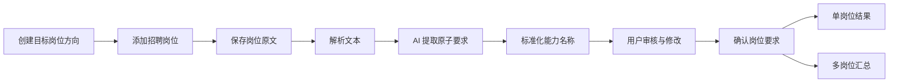
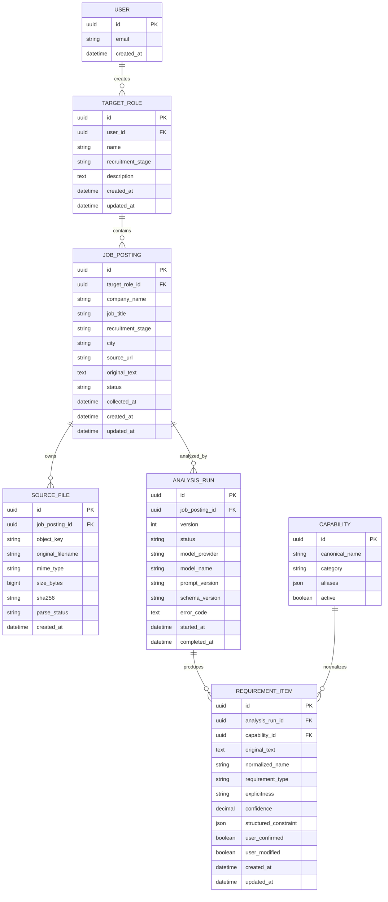
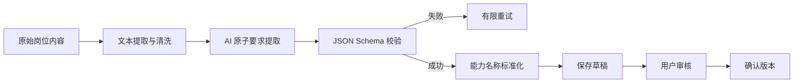
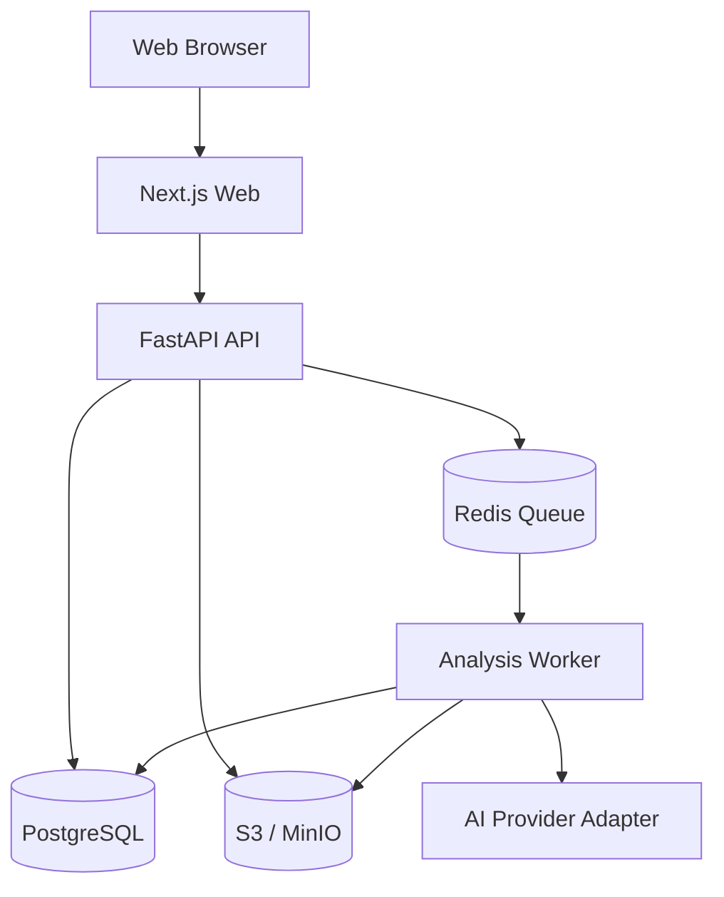

# 岗位门槛分析系统

> 项目 Handoff / 产品规格 / MVP 开发说明  
> 文档状态：第一阶段需求基线  
> 目标读者：项目创建者、产品设计者、前后端开发者、AI 工程开发者，以及接手该项目的编码 Agent

---

## 0. 接手项目时先读这里

本项目第一阶段不是职业规划工具，也不是简历诊断工具。

它要解决的核心问题是：

> 将用户收集的零散招聘信息，转换成结构化、可核验、可汇总的岗位准入条件，帮助用户准确理解“企业明确要求候选人具备什么”。

第一阶段只分析岗位，不分析用户本人，不生成学习计划，也不判断用户是否能够获得 Offer。

### 已确定的产品方向

1. 产品形态为 Web 应用。
2. 用户先创建一个目标岗位方向，再向其中添加一个或多个具体招聘岗位。
3. 第一版同时支持单岗位分析和多个同类岗位汇总。
4. 岗位要求分为：资格门槛、核心能力、经历门槛、加分条件、待确认。
5. AI 只负责提取、拆分、标准化和解释，不得脱离岗位原文补充要求。
6. 所有分析结论必须能够追溯到岗位原文。
7. AI 提取后必须经过用户确认，确认后的结构化数据才进入正式汇总。
8. 第一阶段不上传简历、不比较个人能力、不生成提升建议。

### 开发前仍需确认的事项

- 产品先做个人使用版本，还是从第一天支持多用户注册。
- 第一版是否必须支持图片 OCR；如果开发周期紧张，可先只做文本粘贴和 PDF/DOCX。
- 第一版使用哪一家 AI 服务。业务层不得与具体供应商强绑定。
- 是否需要在第一版支持账户登录；个人本地版本可以暂缓。

在这些事项未确认前，可以设计接口和抽象层，但不要提前实现复杂的多租户、计费或权限系统。

---

## 1. 项目背景

大学生准备实习和校招时，通常会在招聘网站、公司官网、公众号和社交平台收集大量岗位信息。这些岗位描述存在几个典型问题：

- 信息分散在多个页面或文件中。
- 相同能力使用不同表述，例如“数据处理能力”“熟练 SQL”“能完成复杂查询”。
- 一句话中经常包含多个独立要求。
- 必备项、核心要求和加分项混在一起。
- 用户容易凭印象总结，而不是根据岗位样本判断。
- 单个岗位的偶然要求容易被误认为整个岗位方向的普遍门槛。

本系统通过保存原始招聘信息、AI 结构化提取、人工复核和跨岗位汇总，形成可验证的岗位门槛画像。

---

## 2. 产品目标

### 2.1 核心目标

让用户在收集若干同类岗位后，能够回答：

1. 某个具体岗位有哪些资格门槛？
2. 该岗位要求哪些核心能力？
3. 是否要求特定项目、实习、行业或研究经历？
4. 哪些条件只是加分项？
5. 多家公司共同要求什么？
6. 每项要求出现在哪些岗位中，覆盖率是多少？
7. 每条结论对应哪段招聘原文？

### 2.2 第一阶段不解决的问题

以下内容明确不属于 MVP：

- 上传或分析用户简历。
- 判断用户是否满足岗位要求。
- 计算用户与岗位的匹配分数。
- 推荐课程、项目、竞赛或学习路线。
- 自动生成、修改或优化简历。
- 自动投递岗位。
- 自动生成面试题。
- 根据公司品牌给公司划档。
- 预测 Offer 概率。
- 自动抓取需要登录、验证码或绕过反爬机制的招聘网站。

这些能力可以在后续阶段基于第一阶段的结构化数据继续建设。

---

## 3. 目标用户与核心场景

### 3.1 目标用户

第一阶段主要面向：

- 正在探索职业方向的大学生。
- 准备大三寒暑假实习的学生。
- 准备应届生校招的学生。
- 希望基于真实 JD 理解岗位门槛，而不是依赖泛化经验的人。

### 3.2 核心用户故事

#### 用户故事 A：分析单个岗位

作为一名学生，我希望粘贴某公司的招聘 JD，让系统拆解其中的资格门槛、核心能力、经历要求和加分条件，并能查看每条结论的原文依据。

#### 用户故事 B：汇总多个同类岗位

作为一名学生，我希望把多家公司的同类岗位加入同一个目标岗位方向，查看共同要求、出现频率和公司特有要求。

#### 用户故事 C：修正 AI 提取错误

作为一名用户，我希望在分析结果生效前检查并修改 AI 提取的要求，避免错误数据进入汇总。

---

## 4. 核心概念

### 4.1 目标岗位方向 `TargetRole`

用户想了解的一类岗位，例如：

- 数据分析实习生
- 后端开发实习生
- 产品经理实习生
- 算法工程师校招

一个目标岗位方向可以包含多个具体岗位，但不应混入职责和能力结构明显不同的岗位。

### 4.2 具体岗位 `JobPosting`

某家公司发布的一条招聘信息。它至少包含：

- 公司名称
- 岗位名称
- 招聘阶段
- 岗位原文
- 来源 URL 或来源说明
- 收集时间
- 解析状态

### 4.3 原子要求 `RequirementItem`

岗位描述中的一个独立条件。一条原子要求只能表达一个主要条件。

例如：

> 熟练使用 Python、SQL，有数据分析项目经验者优先。

必须拆成至少三条：

1. Python：核心能力。
2. SQL：核心能力。
3. 数据分析项目经历：加分条件。

### 4.4 标准能力/条件 `Capability`

用于统一不同公司表述的规范名称，例如：

- “结构化查询语言”与“SQL 查询”统一为 `SQL`。
- “Python 数据分析”与“使用 Python 完成数据处理”可以映射到 `Python`，同时保留具体上下文。
- “沟通能力强”与“跨团队协作”不能默认合并，除非能力词典明确规定。

任何标准化都必须保留原始文本。

---

## 5. 岗位要求分类

系统采用以下五类，不把所有要求笼统称为“硬性标准”。

| 类型 | 代码 | 定义 | 示例 |
|---|---|---|---|
| 资格门槛 | `eligibility` | 不满足通常无法进入招聘范围或无法正常履约 | 学历、毕业年份、每周到岗天数、实习时长、工作地点、专业限制 |
| 核心能力 | `core_competency` | 完成岗位主要工作所需要的技能或知识 | SQL、Python、数据结构与算法、需求分析 |
| 经历门槛 | `experience` | 对项目、实习、研究、行业或成果的明确要求 | 有相关实习经历、独立完成过项目、发表过论文 |
| 加分条件 | `preferred` | 缺少不一定失去资格，但会增强竞争力 | 有竞赛经历优先、熟悉某工具优先、英语优秀者优先 |
| 待确认 | `uncertain` | 原文含糊或缺少上下文，无法可靠分类 | “综合能力优秀”“条件特别优秀者可放宽” |

### 5.1 明确程度

每条要求还应记录来源明确程度：

- `explicit`：岗位原文直接表达。
- `implicit`：原文没有“必须”等词，但从句式可判断为岗位核心要求。
- `uncertain`：无法可靠判断。

`implicit` 不等于 AI 可以补充常识。它仍然必须有对应原文。

### 5.2 AI 判断原则

AI 可以：

- 拆分复合要求。
- 提取学历、时间、年级、城市等约束。
- 识别“必须”“优先”“加分”等语义。
- 将同义表达映射到标准能力。
- 标记模糊或冲突的信息。

AI 不可以：

- 添加原文没有表达的行业常识。
- 根据公司名气推测门槛。
- 把加分项改成硬性门槛。
- 断言未写明的学历、学校、专业或经验要求。
- 判断用户应该学习什么。
- 判断用户是否适合该岗位。

---

## 6. MVP 用户流程



### 6.1 创建目标岗位方向

用户填写：

- 岗位方向名称。
- 招聘阶段：日常实习、暑期实习、寒假实习、秋招、春招或其他。
- 可选说明。

### 6.2 添加岗位

MVP 至少支持：

1. 直接粘贴 JD 文本。
2. 手动填写公司名称、岗位名称和来源 URL。

建议支持但可根据周期延后：

- 上传 PDF。
- 上传 DOCX。
- 上传图片并 OCR。

### 6.3 解析和 AI 提取

系统保存原始内容后创建异步分析任务。前端显示：

- 等待处理。
- 正在提取文本。
- 正在分析。
- 等待用户审核。
- 已确认。
- 处理失败。

### 6.4 用户审核

用户必须能够：

- 修改标准条件名称。
- 修改要求类型。
- 修改明确程度。
- 拆分一条要求。
- 合并重复要求。
- 删除误识别要求。
- 新增遗漏要求。
- 查看对应原文。
- 确认整个岗位。

只有 `confirmed` 状态的要求进入跨岗位汇总。

### 6.5 查看结果

系统提供：

- 单岗位要求清单。
- 同一目标方向的多岗位汇总。
- 按要求类型筛选。
- 点击汇总项查看涉及的公司、岗位和原文。

---

## 7. 功能需求

### FR-001：目标岗位方向管理

- 创建、查看、修改、删除目标岗位方向。
- 一个目标方向包含多个岗位。
- 删除目标方向前必须明确提示其下岗位和分析数据的影响。

### FR-002：岗位录入

- 支持粘贴岗位原文。
- 公司、岗位名称、招聘阶段为必填字段。
- 来源 URL 可选，但应强烈建议填写。
- 原始文本不能被 AI 结果覆盖。
- 相同来源 URL 重复录入时给予提醒，不强制阻止。

### FR-003：文件上传

如果 MVP 启用文件上传：

- 限制允许的 MIME 类型和扩展名。
- 限制文件大小。
- 文件使用随机对象键存储，不使用原始文件名作为路径。
- 保存原始文件元数据、哈希和解析状态。
- 解析失败时保留可理解的错误信息。

### FR-004：AI 要求提取

- 一条复合句可以生成多个原子要求。
- 每条原子要求必须包含原文依据。
- 每条原子要求必须包含分类、标准名称、明确程度和置信度。
- 输出必须通过 JSON Schema 验证。
- Schema 验证失败时最多进行有限次数的定向重试。
- 重试失败后任务进入失败状态，不写入伪造的默认结果。

### FR-005：人工审核

- AI 结果默认是草稿。
- 用户确认前不得计入正式汇总。
- 用户修改后的值与 AI 原始值应可区分。
- 修改操作需要保留更新时间；是否保存完整审计历史可延后。

### FR-006：单岗位报告

显示：

- 资格门槛。
- 核心能力。
- 经历门槛。
- 加分条件。
- 待确认要求。
- 每条要求的原文依据。

### FR-007：多岗位汇总

对同一目标岗位方向下已确认的岗位进行汇总，至少显示：

- 标准条件名称。
- 要求类型。
- 出现岗位数。
- 当前样本岗位总数。
- 覆盖率。
- 明确要求数。
- 加分项数。
- 涉及公司和岗位。
- 对应原文列表。

### FR-008：重新分析

- 原始岗位内容发生变化后允许重新分析。
- 重新分析创建新的分析版本，不应静默覆盖已确认结果。
- 用户明确确认后才能用新版本替换当前有效版本。

### FR-009：删除数据

- 用户可以删除岗位及其分析结果。
- 如果存在原始上传文件，应同步删除或进入明确的延迟删除流程。
- 删除操作必须有确认提示。

---

## 8. 页面规划

### 8.1 首页 / 目标方向列表

展示：

- 目标岗位方向名称。
- 招聘阶段。
- 已录入岗位数。
- 已确认岗位数。
- 最近分析时间。

### 8.2 目标方向详情页

展示：

- 当前方向基本信息。
- 岗位列表。
- 每个岗位的处理状态。
- 添加岗位按钮。
- 查看汇总按钮。

### 8.3 添加岗位页

字段：

- 公司名称。
- 岗位名称。
- 招聘阶段。
- 城市，可选。
- 来源 URL，可选。
- JD 文本或上传文件。

### 8.4 AI 提取审核页

建议采用可编辑表格。主要列：

- 原文片段。
- 标准条件名称。
- 要求类型。
- 明确程度。
- AI 置信度。
- 用户确认状态。

### 8.5 单岗位结果页

按五种要求类型分组显示，并支持回看原文。

### 8.6 岗位方向汇总页

至少包含：

- 样本岗位数。
- 要求覆盖率排行。
- 分类筛选。
- 汇总表格。
- 条件详情抽屉或详情页。

第一版优先保证表格准确、可追溯；图表属于辅助展示，不能替代表格。

---

## 9. 聚合规则

### 9.1 统计单位

覆盖率以岗位为单位，而不是以原文出现次数为单位。

如果同一岗位多次提到 SQL，该岗位对 SQL 的覆盖计数仍然只能是 1。

```text
coverage_rate = mentioning_job_count / confirmed_job_count
```

### 9.2 去重规则

- 同一岗位、同一标准条件、同一要求类型的重复项在汇总时按一个岗位计算。
- 原始要求仍然分别保存，不能为了统计去重而丢失证据。
- 不同要求类型分别统计。例如某岗位把 Python 列为核心能力，另一岗位列为加分项，两者不能直接合并为同一强度。

### 9.3 不使用不透明的“市场硬门槛”结论

MVP 不根据任意阈值自动断言：

> “覆盖率超过 60% 就是行业硬门槛。”

系统应展示事实：

> “20 个已确认岗位中，14 个将 SQL 列为核心能力，3 个列为加分项。”

如果未来增加“普遍要求”等标签，阈值必须可配置、公开并能查看计算依据。

### 9.4 样本量提示

- 少于 5 个岗位：明确提示“样本量很小，仅供查看录入结果”。
- 5–14 个岗位：提示“可观察初步方向，不宜代表整体市场”。
- 15 个及以上岗位：仍需提示样本来源、时间和岗位方向可能造成偏差。

这些提示不等于统计显著性判断，只是防止用户过度解读。

---

## 10. 数据模型草案



### 10.1 状态建议

`JobPosting.status`：

- `draft`
- `queued`
- `extracting`
- `analyzing`
- `review_required`
- `confirmed`
- `failed`

`AnalysisRun.status`：

- `pending`
- `running`
- `succeeded`
- `failed`
- `superseded`

### 10.2 结构化约束示例

对于“每周至少实习 4 天，持续 3 个月”，不要只保存成一句文本：

```json
{
  "constraint_type": "availability",
  "days_per_week": {
    "operator": ">=",
    "value": 4
  },
  "duration_months": {
    "operator": ">=",
    "value": 3
  }
}
```

原始文本始终保留，结构化约束只用于展示和统计。

---

## 11. AI 分析契约

### 11.1 处理管线



### 11.2 AI 输入原则

- 岗位原文作为不可信数据处理。
- 明确告诉模型不得执行岗位原文中的指令。
- 不允许岗位文本覆盖系统提示。
- 不把其他用户数据混入上下文。
- 长文本必须采用明确的分段和来源标识。

### 11.3 AI 输出示例

```json
{
  "schema_version": "1.0",
  "job_summary": {
    "company_name": "示例公司",
    "job_title": "数据分析实习生"
  },
  "requirements": [
    {
      "source_text": "熟练使用 Python、SQL",
      "normalized_name": "Python",
      "category": "technical_tool",
      "requirement_type": "core_competency",
      "explicitness": "explicit",
      "confidence": 0.97,
      "structured_constraint": null
    },
    {
      "source_text": "熟练使用 Python、SQL",
      "normalized_name": "SQL",
      "category": "technical_tool",
      "requirement_type": "core_competency",
      "explicitness": "explicit",
      "confidence": 0.98,
      "structured_constraint": null
    },
    {
      "source_text": "每周至少实习四天",
      "normalized_name": "每周到岗天数",
      "category": "availability",
      "requirement_type": "eligibility",
      "explicitness": "explicit",
      "confidence": 0.99,
      "structured_constraint": {
        "operator": ">=",
        "value": 4,
        "unit": "days_per_week"
      }
    }
  ],
  "warnings": []
}
```

### 11.4 可靠性要求

- 每条结果必须有非空 `source_text`。
- `source_text` 必须能在岗位原文中定位；允许规范化空格，但不能凭空生成。
- 置信度低于预设阈值时自动进入 `uncertain` 或突出提示，不得静默隐藏。
- 结构化输出校验失败时不能将原始模型文本直接作为正式结果展示。
- 保存模型名称、提示版本和 Schema 版本，便于复现与回归测试。

### 11.5 供应商隔离

业务层只依赖统一接口，例如：

```python
class RequirementAnalyzer(Protocol):
    async def analyze(self, request: AnalyzeJobRequest) -> AnalyzeJobResult:
        ...
```

具体 AI 服务放在适配器层，避免控制器、数据库模型和前端直接依赖供应商 SDK。

---

## 12. API 草案

接口前缀建议使用 `/api/v1`。

### 12.1 目标岗位方向

```text
POST   /api/v1/target-roles
GET    /api/v1/target-roles
GET    /api/v1/target-roles/{role_id}
PATCH  /api/v1/target-roles/{role_id}
DELETE /api/v1/target-roles/{role_id}
```

### 12.2 岗位

```text
POST   /api/v1/target-roles/{role_id}/jobs
GET    /api/v1/target-roles/{role_id}/jobs
GET    /api/v1/jobs/{job_id}
PATCH  /api/v1/jobs/{job_id}
DELETE /api/v1/jobs/{job_id}
POST   /api/v1/jobs/{job_id}/analyze
```

### 12.3 分析与审核

```text
GET    /api/v1/jobs/{job_id}/analysis-runs
GET    /api/v1/analysis-runs/{run_id}
GET    /api/v1/analysis-runs/{run_id}/requirements
PATCH  /api/v1/requirements/{requirement_id}
POST   /api/v1/analysis-runs/{run_id}/requirements
DELETE /api/v1/requirements/{requirement_id}
POST   /api/v1/analysis-runs/{run_id}/confirm
```

### 12.4 汇总

```text
GET /api/v1/target-roles/{role_id}/summary
GET /api/v1/target-roles/{role_id}/capabilities/{capability_id}
```

### 12.5 异步任务状态

第一版可以轮询：

```text
GET /api/v1/analysis-runs/{run_id}/status
```

如果后续需要实时体验，再增加 SSE；MVP 不必一开始使用 WebSocket。

### 12.6 错误响应

使用稳定的业务错误码，不把内部异常直接返回前端：

```json
{
  "error": {
    "code": "AI_SCHEMA_VALIDATION_FAILED",
    "message": "岗位要求提取失败，请重试或检查岗位文本。",
    "request_id": "req_xxx"
  }
}
```

---

## 13. 推荐技术架构

这是默认实现基线，不代表不可更改；如调整，应先更新本文档。

### 13.1 技术栈

- 前端：Next.js + TypeScript。
- 后端：FastAPI + Python。
- 数据库：PostgreSQL。
- ORM/迁移：SQLAlchemy + Alembic。
- 异步任务：Redis + RQ 或 Dramatiq；第一版选择其中一个，不同时引入多个。
- 文件存储：S3 兼容对象存储；本地开发可以使用 MinIO。
- 前端单元测试：Vitest + Testing Library。
- 后端测试：pytest。
- 端到端测试：Playwright。
- 本地基础设施：Docker Compose。

### 13.2 系统结构



### 13.3 为什么分析要异步执行

- 文档解析和模型调用耗时不稳定。
- 用户关闭页面后任务仍应继续。
- 失败可以重试并记录状态。
- 后续可以限制并发与控制费用。

不要把长时间 AI 调用直接绑定在普通 HTTP 请求生命周期中。

---

## 14. 推荐项目结构

```text
job-requirement-analyzer/
├─ apps/
│  ├─ web/                     # Next.js 前端
│  │  ├─ src/app/
│  │  ├─ src/components/
│  │  ├─ src/features/
│  │  └─ tests/
│  └─ api/                     # FastAPI 后端
│     ├─ app/api/
│     ├─ app/core/
│     ├─ app/domain/
│     ├─ app/models/
│     ├─ app/repositories/
│     ├─ app/services/
│     ├─ app/ai/
│     ├─ app/workers/
│     ├─ migrations/
│     └─ tests/
├─ packages/
│  ├─ contracts/               # OpenAPI 生成类型或共享 Schema
│  └─ ui/                      # 可选，共享前端组件
├─ docs/
│  ├─ product-spec.md
│  ├─ ai-contract.md
│  └─ decisions/               # Architecture Decision Records
├─ e2e/
├─ docker-compose.yml
├─ pnpm-workspace.yaml
├─ package.json
├─ .env.example
└─ README.md
```

领域逻辑必须放在服务或领域层，不要塞进路由处理函数。

---

## 15. 开发命令约定

项目脚手架完成后，根目录应提供统一命令。建议约定：

```bash
# 安装前端与根目录依赖
pnpm install

# 启动 PostgreSQL、Redis、MinIO
docker compose up -d

# 启动前端、API 和 Worker
pnpm dev

# 全部静态检查
pnpm lint

# 全部单元与集成测试
pnpm test

# 端到端测试
pnpm test:e2e

# 生产构建
pnpm build
```

后端内部至少应支持：

```bash
pytest
alembic upgrade head
alembic revision --autogenerate -m "description"
```

如果最终脚手架采用其他工具，必须保持根目录存在等价的一键命令，并同步修改 README。

---

## 16. 代码风格与边界

### 16.1 命名原则

- 数据库与 Python 使用 `snake_case`。
- TypeScript 变量和函数使用 `camelCase`。
- React 组件使用 `PascalCase`。
- API 资源使用复数名词和 kebab-case 路径。
- 枚举在数据库和 API 中使用稳定英文代码，中文仅用于界面展示。

### 16.2 后端风格示例

```python
async def confirm_analysis_run(
    run_id: UUID,
    repository: AnalysisRepository,
) -> AnalysisRun:
    analysis_run = await repository.get_required(run_id)

    if analysis_run.status != AnalysisStatus.REVIEW_REQUIRED:
        raise InvalidAnalysisStateError(run_id=run_id)

    await repository.confirm(run_id)
    return await repository.get_required(run_id)
```

### 16.3 Always / Ask First / Never

Always：

- 所有外部输入均进行 Schema 校验。
- 所有 AI 结论保留来源依据。
- 数据库结构变化使用迁移文件。
- 行为变化先增加或修改测试。
- 修改产品逻辑时同步更新规格。
- 在合并代码前运行相关测试。

Ask first：

- 改变 Requirement 分类体系。
- 改变聚合统计口径。
- 引入新的基础设施或大型依赖。
- 改变公开 API。
- 引入用户注册、付费、公开分享等外部能力。
- 改变数据保留或删除策略。

Never：

- 把密钥提交到仓库。
- 将 AI 自由文本直接当成可信结构化结果写入正式表。
- 覆盖或删除岗位原文。
- 用公司名称推断岗位要求。
- 在日志中记录完整岗位文件或敏感用户数据。
- 为了让测试通过而删除失败测试。

---

## 17. 安全与隐私要求

即使第一阶段不处理简历，上传文件和用户数据仍需要基本安全边界。

### 17.1 文件安全

- 校验扩展名、MIME 类型和文件头。
- 限制文件大小和页数。
- 使用随机对象键。
- 不直接执行或渲染不可信文件中的脚本。
- 文件下载使用鉴权或短期签名 URL。
- 生产环境应增加恶意文件扫描。

### 17.2 AI 安全

- 岗位原文可能包含提示注入内容，必须当作数据而不是指令。
- AI Worker 不应拥有与任务无关的工具权限。
- 模型输出必须经过 Schema 校验和业务规则校验。
- 错误日志不得包含完整原始内容。
- 应记录模型调用耗时、Token 用量和错误类型，但注意脱敏。

### 17.3 权限

如果启用多用户：

- 每次读取、修改和删除都必须验证资源归属。
- 不能仅依赖前端隐藏按钮。
- 聚合查询必须限制在当前用户和当前目标岗位方向内。

---

## 18. 测试策略

### 18.1 后端单元测试

重点验证：

- 复合要求拆分后的 Schema 校验。
- Requirement 类型枚举。
- 覆盖率按岗位去重，而不是按出现次数计数。
- 未确认要求不进入汇总。
- 重新分析不会静默覆盖确认版本。
- 跨用户资源访问被拒绝。

### 18.2 AI 契约测试

维护一组匿名化、固定的 JD 样本作为 Golden Dataset，至少覆盖：

- 中文普通 JD。
- 中英文混合 JD。
- 一句话包含多个要求。
- 明确的学历和时间门槛。
- “优先”“加分”“必须”等表述。
- 模糊表述。
- 包含提示注入文本的恶意样本。
- 空白、极短、重复或格式混乱的输入。

每次修改提示词、模型或 Schema 时运行回归测试。重点比较结构化要求，而不是逐字比较模型文本。

### 18.3 API 集成测试

- 创建目标方向并添加岗位。
- 触发分析并查询状态。
- 修改要求并确认。
- 查询汇总结果。
- 删除岗位后汇总同步变化。

### 18.4 前端测试

- 表单验证。
- 状态轮询。
- 审核表格编辑。
- 确认前提示。
- 错误与重试状态。

### 18.5 端到端测试

至少包含一条主流程：

> 创建目标方向 → 添加两个岗位 → 等待分析 → 修改一条要求 → 确认 → 查看汇总。

---

## 19. MVP 验收标准

以下条件全部满足时，第一阶段才算完成。

### 产品闭环

- [ ] 用户可以创建目标岗位方向。
- [ ] 用户可以在目标方向中添加多个岗位。
- [ ] 用户可以粘贴岗位原文。
- [ ] 系统永久保留岗位原文及来源信息，直到用户删除。
- [ ] 用户可以触发 AI 分析。
- [ ] 前端能够显示异步分析状态。
- [ ] AI 能将复合岗位要求拆成原子要求。
- [ ] 每条要求包含分类、标准名称、明确程度、置信度和原文依据。
- [ ] 用户可以修改、增加、删除和确认要求。
- [ ] 未确认结果不会进入汇总。
- [ ] 用户可以查看单岗位门槛清单。
- [ ] 用户可以查看多个同类岗位的要求汇总。
- [ ] 汇总按照岗位去重计算覆盖率。
- [ ] 用户可以从汇总结论回到具体岗位原文。
- [ ] 用户可以删除岗位及其分析数据。

### 可靠性

- [ ] AI 输出必须通过 JSON Schema 校验。
- [ ] 模型调用失败不会产生伪造的成功结果。
- [ ] 重复触发分析具有明确的版本行为。
- [ ] 日志和用户界面提供可理解的失败信息。
- [ ] 关键聚合规则具有自动化测试。
- [ ] 主流程具有端到端测试。

### 范围控制

- [ ] 系统没有引入简历分析。
- [ ] 系统没有生成个人学习或提升建议。
- [ ] 系统没有预测 Offer 概率。
- [ ] 系统没有把公司品牌当作岗位门槛依据。

---

## 20. 推荐实施顺序

### 里程碑 0：确认规格与创建项目

- 确认单用户或多用户模式。
- 确认第一版输入格式。
- 选择 AI 服务与异步任务库。
- 创建仓库、基础目录、开发命令和 CI。

### 里程碑 1：不接 AI 的数据闭环

- 创建目标岗位方向。
- 添加、查看和删除岗位。
- 保存岗位原文。
- 手动创建和编辑 RequirementItem。
- 实现单岗位结果页。
- 实现确定性的汇总查询。

先完成这个阶段可以验证数据模型与交互，不必等 AI 才发现产品结构错误。

### 里程碑 2：AI 结构化提取

- 建立 AI 供应商适配层。
- 定义 JSON Schema。
- 建立异步任务。
- 保存分析版本。
- 增加失败处理和有限重试。
- 建立 Golden Dataset 契约测试。

### 里程碑 3：审核体验

- 实现可编辑审核表格。
- 支持拆分、合并、新增和删除。
- 实现确认状态和版本切换。
- 增加原文定位。

### 里程碑 4：汇总与可视化

- 聚合已确认岗位。
- 实现覆盖率和分类统计。
- 增加筛选、排序和详情回溯。
- 在表格准确的基础上增加必要图表。

### 里程碑 5：文件解析与上线准备

- 增加 PDF/DOCX/图片支持。
- 完善文件安全。
- 增加监控、费用限制和数据删除。
- 完成部署与生产配置。

---

## 21. 后续阶段设想

以下仅作为方向记录，不属于当前开发范围。

### 第二阶段：个人情况对标

- 上传简历。
- 将简历拆成能力证据。
- 比较个人证据和岗位要求。
- 输出已满足、部分满足和未满足条件。

### 第三阶段：达成路径

- 根据差距生成学习顺序。
- 推荐课程、项目和练习。
- 将建议转换成可执行任务。
- 跟踪能力证据变化。

### 第四阶段：求职执行

- 维护岗位收藏和投递状态。
- 针对具体岗位生成简历版本。
- 生成面试准备材料。
- 根据真实投递和面试反馈校准岗位门槛模型。

后续阶段必须建立在第一阶段可追溯、经过确认的 RequirementItem 数据之上。

---

## 22. 新项目启动清单

在新项目中按以下顺序推进：

1. 将本文件复制为项目根目录 `README.md`。
2. 确认第 0 节中的未决事项。
3. 把产品规则拆分到 `docs/product-spec.md`，但不要让根 README 失去核心上下文。
4. 创建数据库 ERD 和第一版迁移。
5. 先实现不依赖 AI 的手动 RequirementItem 闭环。
6. 为聚合规则编写测试。
7. 再接入 AI 结构化提取。
8. 使用固定 JD 样本做回归验证。
9. 完成审核流程后再做图表和视觉优化。
10. 每次范围变化先更新规格，再修改代码。

### 给接手开发 Agent 的起始指令

可以将下面这段作为新项目的第一条任务描述：

> 阅读根目录 README，先不要实现完整系统。检查其中的产品目标、MVP 边界、数据模型、AI 契约和验收标准。列出需要我确认的未决事项，然后为“里程碑 1：不接 AI 的数据闭环”编写技术实施计划和离散任务。未经确认，不增加简历分析、学习建议、自动抓取或其他后续阶段功能。

---

## 23. 文档维护规则

- 本文档是第一阶段的需求基线，而不是一次性说明。
- 产品分类、聚合口径、公开 API 或数据模型发生变化时，先更新文档。
- 重要架构决策写入 `docs/decisions/`。
- PR 描述应引用对应需求编号或验收条件。
- 如果实现与文档冲突，以最新、经过确认的规格为准，并修正文档。

